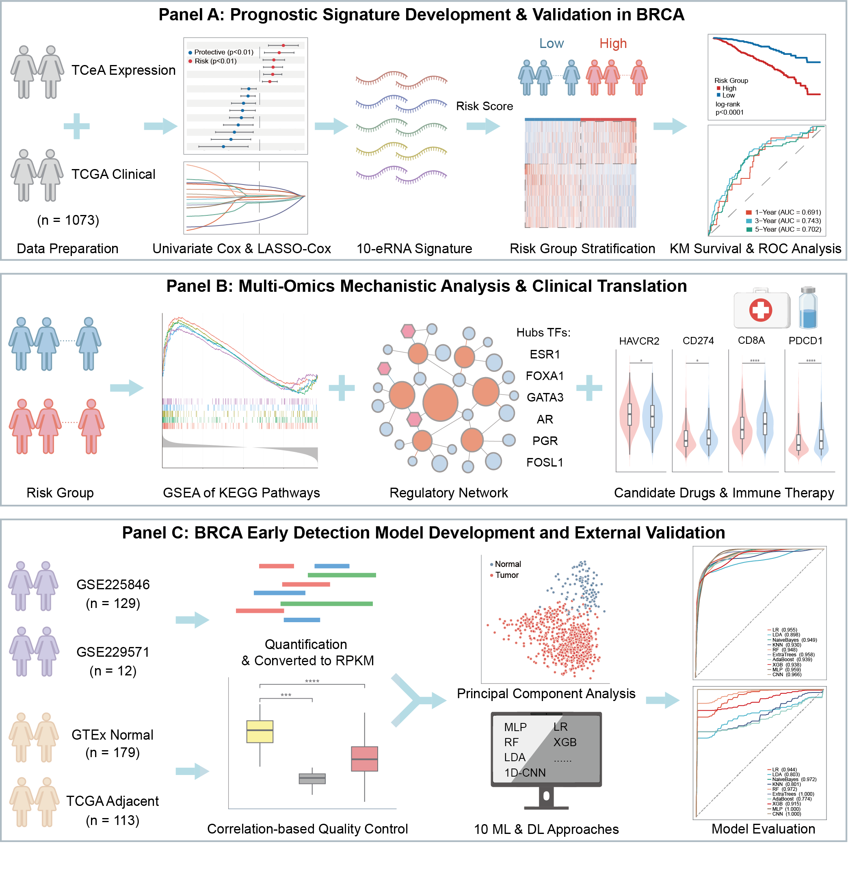

# TCGA-BRCA eRNA Early-Stage Detection Project
[](https://doi.org/10.5281/zenodo.21381664)
[](https://opensource.org/licenses/MIT)
[](https://www.python.org/)
[]()
[]()
[](https://limseu.shinyapps.io/ernacare/)

## 📌 Project Overview
This repository contains the complete Python-based machine learning and deep learning pipeline for the early-stage discrimination of Breast Cancer (BRCA) using enhancer RNA (eRNA) profiles. 

As a parallel extension to our Prognostic Signature Project ([BRCA-eRNA-Prognosis](https://github.com/LIMwhatnameisavailable/BRCA-eRNA-Prognosis)), this module rigorously defines a "normal-like" reference to mitigate field cancerization, quantifies eRNA expression from raw RNA-seq data of independent cohorts (GSE225846, GSE229571), and evaluates 10 distinct classification algorithms. The pipeline features a quantification script, data leakage prevention during preprocessing, and an advanced Attention-1D-CNN model.

<p align="center">
  
</p>

## 🌐 Interactive Web Application 
To make our models accessible to clinicians and researchers without programming expertise, we have deployed a user-friendly online tool: eRNACare. You can upload your own eRNA expression profiles to get real-time diagnostic predictions without running any code.

### **Access the Web App here:** [ernacare](https://limseu.shinyapps.io/ernacare/)

## 📂 Repository Structure
The repository is designed as a standalone project, organized chronologically from raw data quantification to model bootstrap evaluation.
*Note: Lightweight annotation and reference files are included in `Data_Source/`, but raw sequencing data and large clinical matrices must be downloaded separately due to GitHub size limitations.*

```text
BRCA-eRNA-Early-Detection/
├── README.md                           <-- Project documentation
├── Data_Source/                        <-- Required input files (See Data Preparation)
├── Scripts/                            
│   ├── 0_Quant_Pipeline.sh   <-- HISAT2 & featureCounts pipeline
│   ├── core_nested_cv_pipeline.py             <-- Nested CV pipeline: ANOVA + LASSO + 10 classifiers
│   ├── generate_clean_data.py                 <-- Data cleaning & target matching across cohorts
│   ├── batch_effect_evaluation.py             <-- Batch effect PCA evaluation (Fig S11)
│   ├── batch_effect_replacement.py            <-- Batch effect replacement analysis
│   └── subtype_analysis/
│       └── run_subtype_analysis.py            <-- PAM50 and clinical subtype AUC analysis
├── ExternalValidationData/            <-- Processed counts matrices for external validation
│   ├── eRNA_standard_500bp_hg38.saf   <-- hg38 (liftOver from original hg19)
│   ├── GSE225846/counts_matrix_500bp_clean.txt.gz
│   └── GSE229571/counts_matrix_500bp_clean.txt.gz
├── Results/                           <-- All results, figures, tables, and trained models
│   ├── Analysis_Results/              <-- Nested CV results, signature lists, metrics
│   ├── Figures/                       <-- ROC curves, PCA batch effect plots (Fig S11)
│   ├── Supplementary_Tables/          <-- Supplementary Tables S13-S26
│   └── Trained_Models/                <-- 11 trained ML/DL models (.pkl)
└── environment/                       <-- Conda environment configuration
```

## 💾 Data Preparation

The `Data_Source/` directory contains lightweight annotation and reference
files that are already included in this repository. Large files (TCeA
expression matrices, clinical data) and raw sequencing data must be
obtained separately.

---

### ✅ Files Already Included in `Data_Source/`

| **File** | **Source** |
| :--- | :--- |
| `SraRunTable_GSE225846.csv` | **NCBI SRA** (GEO: GSE225846) |
| `SraRunTable_GSE229571.csv` | **NCBI SRA** (GEO: GSE229571) |
| `Normal_like_samples.csv` | Generated by Prognosis Script 8 |
| `TCGA-BRCA.clinical.tsv` | **GDC TCGA BRCA** |

**File descriptions:**
- **`SraRunTable_GSE225846.csv`** — SRA run metadata for external cohort 1; used for sample annotation and stage filtering.
- **`SraRunTable_GSE229571.csv`** — SRA run metadata for external cohort 2; used for sample annotation and stage filtering.
- **`Normal_like_samples.csv`** — Purified normal reference sample list after GTEx-based field cancerization filtering.
- **`TCGA-BRCA.clinical.tsv`** — TCGA-BRCA clinical phenotype file; used for sample annotation.

---

### ⬇️ Files That Must Be Downloaded

Place all files directly in `Data_Source/`. **Filenames must be exact.**

| **File** | **Source** | **Notes** |
| :--- | :--- | :--- |
| `TCGA_RPKM_eRNA_300k_peaks_in_Super_enhancer_BRCA.txt` | **TCeA** | TCGA-BRCA eRNA RPKM matrix (~300k super-enhancer peaks) |
| `TCGA.BRCA.sampleMap_BRCA_clinicalMatrix` | **UCSC Xena** | Clinical matrix for PAM50 subtype analysis |

---

### 🧬 Raw Sequencing Data (FASTQ)

Pre-computed expression matrices for GSE225846 and GSE229571 are available in `ExternalValidationData/`. If you wish to reproduce from raw data:

**Step 1 — Download raw FASTQ files**

**Step 2 — Run Script 0 to align and quantify**

⚠️ Note: A pre-built HISAT2 index for GRCh38 is required.
Download from the HISAT2 index page
and set the --index path accordingly in the script.

---

### 🌐 External Validation Datasets

| Cohort | Link |
| :--- | :--- |
| GSE225846 | [link to GSE225846](https://www.ncbi.nlm.nih.gov/geo/query/acc.cgi?acc=GSE225846) |
| GSE229571 | [link to GSE229571](https://www.ncbi.nlm.nih.gov/geo/query/acc.cgi?acc=GSE229571) |

---

### ⚠️ Genome Build Note

The annotation file `eRNA_standard_500bp_hg38.saf` in `ExternalValidationData/` has been converted from the original **hg19** coordinates to **hg38** via liftOver. All analysis scripts in this repository expect hg38 coordinates.

### 📁 Result Directories

| Directory | Description |
| :--- | :--- |
| `Results/Analysis_Results/` | Nested CV summary CSVs, final signature lists, and external validation SCI metrics |
| `Results/Figures/` | ROC curves (GSE225846, GSE229571), nested CV AUC distribution, and batch effect PCA plots (Fig S11) |
| `Results/Supplementary_Tables/` | Supplementary Tables S13–S26 (early detection signature, top300 features, nested CV summary, PAM50/subtype AUC) |
| `Results/Trained_Models/` | 11 trained ML/DL model `.pkl` files (ready for deployment) |

## 🚀 How to Run the Pipeline

### Part I: High-Performance Data Quantification
**Script 0: `0_Quant_Pipeline.sh`**
*   **Function:** A Bash script utilizing FIFO named pipes for concurrency control. It aligns raw FASTQ files using `HISAT2`, pipes directly to `samtools sort` to save I/O, and performs multi-threaded quantification using `featureCounts` against the custom 500bp SAF file.
*   **Output:** Generates `counts_matrix_500bp_clean.txt` for each GSE dataset.

### Part II: Nested Cross-Validation Pipeline
**Script 1: `core_nested_cv_pipeline.py`**
*   **Function:** Implements a 10-fold nested cross-validation framework. Performs ANOVA feature selection, Bootstrap LASSO regression to derive a 19-eRNA diagnostic signature, and evaluates 10 ML/DL classifiers (XGBoost, AdaBoost, ExtraTrees, RF, KNN, LDA, LR, NaiveBayes, MLP, CNN). Outputs nested CV AUC distributions, final signature list, and external validation metrics.

**Script 2: `generate_clean_data.py`**
*   **Function:** Loads TCGA eRNA RPKM expression, filters normal-like references, and constructs clean training/test datasets. Converts GEO raw counts to RPKM using matched eRNA length normalization.

**Script 3: `batch_effect_evaluation.py` & `batch_effect_replacement.py`**
*   **Function:** Evaluates batch effects across TCGA, GSE225846, and GSE229571 using PCA under different normalization strategies. Generates Fig S11 comparing Log1p, Z-score, RankGauss, and the proposed Robust + L2 normalization pipelines.

**Script 4: `run_subtype_analysis.py`** (`Scripts/subtype_analysis/`)
*   **Function:** PAM50 and clinical subtype-stratified AUC analysis for the early detection signature. Generates subtype-specific prediction scores and ROC metrics.

## 🛠 Dependencies
*   **Python Environment:** Python 3.9+, `scikit-learn` (1.6.1), `PyTorch` (2.3.1), `joblib`, `numpy`, `pandas`, `matplotlib`.
*   **Bioinformatics Tools:** `HISAT2`, `samtools`, `featureCounts` (Subread package).

## 📜 License
This project is licensed under the [MIT License](LICENSE).
The TCGA and GEO data are subject to their respective original license terms.

---

State Key Laboratory of Digital Medical Engineering, School of Biological Science and Medical Engineering, Southeast University

Contact: 213230182@seu.removethis.edu.cn

